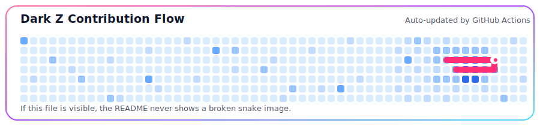

 
 

---

<table>
  <tr>
    <td width="58%" valign="top">
      <h2>👑 Professional Snapshot</h2>
      <pre lang="yaml"><code>name: Dark Z
location: Bangladesh
role: Student Developer
brand: Dark, premium, fast, and practical
craft:
  - Python automation and productivity tools
  - Responsive websites and landing pages
  - Dashboards, utilities, and experimental builds
  - Clean project structure with sharp presentation
standards:
  - Useful before flashy
  - Polished before published
  - Consistent growth every week
  - Strong visuals with reliable functionality</code></pre>
      
I create <b>automation systems, modern web pages, dashboards, and utility projects</b> that combine practical problem-solving with a bold visual identity.

      
My goal is simple: build projects that look <b>premium</b>, work <b>smoothly</b>, and keep improving with every commit.

    </td>
    <td width="42%" valign="top">
      <h2>⚡ Signature Style</h2>
      
      
      
      
       
       
      <blockquote><b>Build beautifully. Automate smartly. Improve relentlessly.</b></blockquote>
      
<b>Current focus:</b> stronger Python projects, cleaner interfaces, better public repos, and consistent GitHub activity.

    </td>
  </tr>
</table>

---

## 🧰 Premium Tech Arsenal

 
 

---

## 🚀 Build Categories

<table>
  <tr>
    <td align="center" width="25%">
      <h3>⚙️ Automation</h3>
      
Scripts, workflow tools, bots, and utilities that reduce repetitive work.

    </td>
    <td align="center" width="25%">
      <h3>🌐 Web</h3>
      
Modern landing pages, responsive layouts, dashboards, and polished UI builds.

    </td>
    <td align="center" width="25%">
      <h3>📊 Dashboards</h3>
      
Readable panels, management screens, and useful project interfaces.

    </td>
    <td align="center" width="25%">
      <h3>🧪 Labs</h3>
      
Experimental projects that turn rough ideas into real working products.

    </td>
  </tr>
</table>

---

## 💎 Featured Repositories

 

---

## 📊 Live GitHub Performance

 
 

 
 

---

## 🏆 Progress Indicators

 
 

---

## 🐍 Contribution Snake

<picture>
  <source media="(prefers-color-scheme: dark)" srcset="dist/github-snake-dark.svg" />
  <source media="(prefers-color-scheme: light)" srcset="dist/github-snake.svg" />
  
</picture>

 

The snake files are now committed in <code>dist/</code>, so the README has a working image immediately. The GitHub Action refreshes them after new activity.

---

## 🧭 Growth Roadmap

<table>
  <tr>
    <td>🎨 Build public repositories with a stronger visual identity</td>
    <td>🐍 Improve Python automation structure and reliability</td>
  </tr>
  <tr>
    <td>⚡ Create faster, cleaner, more responsive interfaces</td>
    <td>🚀 Keep shipping projects that show consistency and skill</td>
  </tr>
</table>

---

## 🌐 Connect With Me

---

### 💀 Code with power. Design with taste. Ship with confidence.

